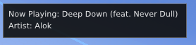
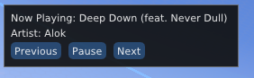

# 🎵 Musical

A [BakkesMod](https://bakkesmod.com/) plugin that displays the currently playing media from Windows directly inside Rocket League. Seamlessly see your "Now Playing" track without ever tabbing out!

---

## ✨ Features

- 🎶 Displays current song title and artist
- ⏯️ Control media (Play, Pause, Next, Previous)
- 🖥️ Works with any media playing via Windows (e.g. Spotify, YouTube, etc.)

---

## 📦 Installation

1. Open the Plugin-Manager in Plugins tab in BakkesMod
2. Enter the ID [ID]
3. Press the button "Install By ID"
4. Enjoy the plugin!

---

## 🖼️ Preview

Controls are displayed when the main BakkesMod Gui is showing.

---

## 🛠️ Notes

- Requires media to be playing through a Windows-compatible source.
- Tested with Spotify and Commonly Used Browsers.
- Report bugs to my discord (mediacy) or create an issue on github.

---

## 🔗 Credits

Made with ❤️ by [Mediacy]  
Powered by ImGui and the BakkesMod SDK